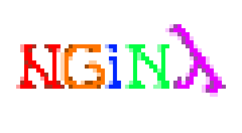

# Nginy

  

A minimalist, educational web server written in ~100 lines of C.
Nginy is for people who love the simplicity of static websites.

# What is a webserver?

If we strip down all the details, a webserver is just a program that listens to messages from other program, and then answers them accordingly.

** That is exactly what Nginy does: **
1. Listen for a connection on PORT (default 8080)
2. Parse and sanitize the request. 
3. Stream the file back to the client.
4. Go back to Step 1.

